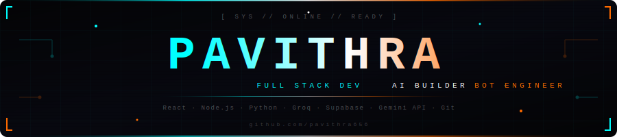

<!--
██████╗  █████╗ ██╗   ██╗██╗████████╗██╗  ██╗██████╗  █████╗
██╔══██╗██╔══██╗██║   ██║██║╚══██╔══╝██║  ██║██╔══██╗██╔══██╗
██████╔╝███████║██║   ██║██║   ██║   ███████║██████╔╝███████║
██╔═══╝ ██╔══██║╚██╗ ██╔╝██║   ██║   ██╔══██║██╔══██╗██╔══██║
██║     ██║  ██║ ╚████╔╝ ██║   ██║   ██║  ██║██║  ██║██║  ██║
╚═╝     ╚═╝  ╚═╝  ╚═══╝  ╚═╝   ╚═╝   ╚═╝  ╚═╝╚═╝  ╚═╝╚═╝  ╚═╝
github.com/pavithra656
-->

<div align="center">



<br/>

[](https://git.io/typing-svg)

<br/>


</div>

---

<div align="center">

```
┌──────────────────────────────────────────────────────────┐
│  [ SYS // ONLINE // READY ]                              │
│                                                          │
│  > whoami                                                │
│  Pavithra Suresh Guttal                                  │
│  BCA Graduate · Davangere, Karnataka 🇮🇳                 │
│  Building real things. Shipping real work.               │
│  Open to roles · Fiverr · Contra · Remote                │
│  0 notice period · Available immediately                 │
└──────────────────────────────────────────────────────────┘
```

</div>

---

## `[ STATS.EXE ]`

<div align="center">

| 🔵 PROJECTS | 🟠 CGPA | ⚪ TECH SKILLS | 🔵 NOTICE PERIOD |
|:-----------:|:-------:|:--------------:|:----------------:|
| **5+** | **9.64** | **15+** | **0 days** |

</div>

---

## `[ ABOUT_ME ]`

```javascript
const pavithra = {
  name        : "Pavithra Suresh Guttal",
  location    : "Davangere, Karnataka 🇮🇳",
  education   : "BCA Graduate — Davangere University (2023–2026)",
  building    : ["Web Apps", "AI Chatbots", "Lead Gen Tools"],
  learning    : ["Next.js", "DSA", "Python Backend", "SQL"],
  funFact     : "Built ALL of this from my PHONE. No laptop. 📱",
  status      : "OPEN TO WORK → 0 notice period 🔥"
};
```

---

## `[ TECH_STACK ]`

**🔵 FRONTEND**


**🟠 BACKEND & DATABASE**


**⚪ AI / LLM**


**🔵 TOOLS**


---

## `[ PROJECTS --deployed ]`

| # | Project | Stack | What it does | Live |
|---|---------|-------|-------------|------|
| 🔵 01 | **Kidoo AI Chatbot** | React · Groq LLaMA 3.3-70B · Gemini | AI appointment bot with real LLM + fallback | [→ Live](https://pavithra656.github.io/Kido/kidoo.html) |
| 🟠 02 | **The Hood by Olive** | HTML · CSS · JS | Full restaurant site, mobile-first, production | [→ Live](https://pavithra656.github.io/hood-by-olive/) |
| ⚪ 03 | **Zoca Cafe** | Supabase · Lovable · JS | Cafe site with real booking backend | Portfolio |
| 🔵 04 | **NYC Dental Leads** | Python · Research · Excel | 30 verified leads — Fiverr delivery | Delivered |
| 🟠 05 | **Kido Voice AI** | Puter.js · OpenAI Onyx | Jarvis-style voice AI in browser | WIP 🔧 |

---

## `[ GITHUB_STATS.EXE ]`

<div align="center">


</div>

<div align="center">

[](https://git.io/streak-stats)

</div>

---

## `[ CONTRIBUTION_SNAKE ]`

<div align="center">

<picture>
  <source media="(prefers-color-scheme: dark)" srcset="https://raw.githubusercontent.com/pavithra656/pavithra656/output/github-contribution-grid-snake-dark.svg"/>
  <source media="(prefers-color-scheme: light)" srcset="https://raw.githubusercontent.com/pavithra656/pavithra656/output/github-contribution-grid-snake.svg"/>
  
</picture>

</div>

---

## `[ CURRENTLY_WORKING_ON ]`

```
🔵 [████████████░░░░░░░░] 60%  →  Next.js + Backend APIs
🟠 [██████████░░░░░░░░░░] 50%  →  DSA & Problem Solving  
⚪ [█████████░░░░░░░░░░░] 45%  →  Client Outreach (Cafes & Salons, KA)
🔵 [██████░░░░░░░░░░░░░░] 30%  →  Portfolio v2
```

---

## `[ FIND_ME --online ]`

<div align="center">

[](mailto:pavithrasureshguttal@gmail.com)
[](https://github.com/pavithra656)
[](https://www.fiverr.com/pavi0_0)
[](https://contra.com)

</div>

---

<div align="center">

```
╔══════════════════════════════════════════════════════════╗
║                                                          ║
║   "I don't wait to feel ready.                           ║
║    I just build and figure it out."                      ║
║                                                          ║
║                              — Pavithra                  ║
╚══════════════════════════════════════════════════════════╝
```


</div>

